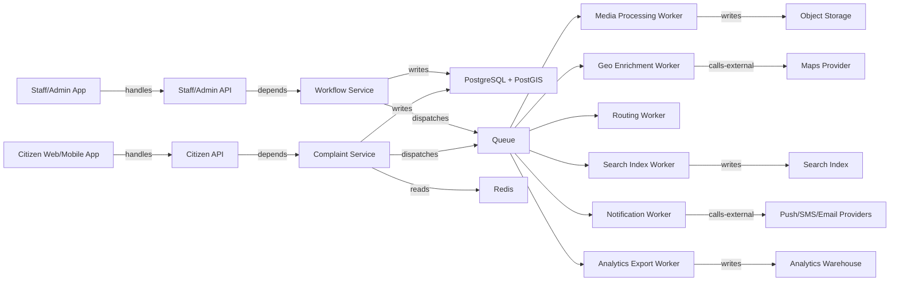

# Backend Architecture

## Goal
Build a smart city complaint platform where citizens report municipal issues such as water leaks, flooded areas, road damage, broken street lights, waste problems, drainage faults, and similar city-service incidents with text, photos, video, and location. City staff should triage, assign, resolve, and measure SLA performance across districts and departments. The system should stay smooth at up to 10 million registered users and roughly 1 million concurrent users by keeping request paths short, moving fan-out work to jobs, and treating geospatial, search, notifications, and analytics as separate architecture nodes.

## Assumptions
- The product is a "smart city complaint system" based on the shared chat title.
- The current workspace has no application code yet, so this is a greenfield backend design.
- Mobile and web clients both exist.
- Complaints may include media uploads, geolocation, department routing, district ownership, comments, status changes, and citizen notifications.
- Target shape is up to 10 million registered users and 1 million concurrent users.

## Architecture Summary
Start with a modular monolith, not microservices. One deployable backend should own the main write path while Redis, a queue, object storage, search, and analytics support it. Split domains later only when a domain becomes a clear scaling hotspot or needs isolated ownership.

Recommended stack:
- API: `NestJS` or `Fastify` on Node.js
- Primary DB: `PostgreSQL` with `PostGIS`
- Cache and rate limiting: `Redis`
- Queue: `SQS` + workers, or `BullMQ` on Redis if staying simpler at first
- Object storage: `S3`-compatible bucket
- Search: `OpenSearch` or `Meilisearch`
- Observability: `OpenTelemetry` + logs + metrics + traces

## Main Nodes
- Entry points:
  - `Citizen API`
  - `Staff/Admin API`
  - `Webhook API`
- Services:
  - `Auth Service`
  - `Complaint Service`
  - `Media Service`
  - `Routing Service`
  - `Workflow Service`
  - `Notification Service`
  - `Comment Service`
  - `SLA Service`
  - `Search Sync Service`
  - `Analytics Service`
  - `Moderation Service`
- Data stores:
  - `PostgreSQL`
  - `Redis`
  - `Object Storage`
  - `Search Index`
  - `Analytics Warehouse`
- Jobs and workers:
  - `Media Processing Worker`
  - `Geo Enrichment Worker`
  - `Complaint Fanout Worker`
  - `SLA Timer Worker`
  - `Search Index Worker`
  - `Analytics Export Worker`
  - `Notification Worker`
- External systems:
  - `SMS Provider`
  - `Email Provider`
  - `Push Provider`
  - `Maps/Geocoding Provider`

## Main Edges
- `Citizen API handles Complaint Controller`
- `Staff/Admin API handles Workflow Controller`
- `Complaint Controller depends Complaint Service`
- `Complaint Service writes PostgreSQL`
- `Complaint Service dispatches ComplaintCreated`
- `ComplaintCreated dispatches Media Processing Worker`
- `ComplaintCreated dispatches Geo Enrichment Worker`
- `ComplaintCreated dispatches Routing Worker`
- `ComplaintCreated dispatches Search Index Worker`
- `ComplaintCreated dispatches Notification Worker`
- `Workflow Service writes PostgreSQL`
- `Workflow Service dispatches ComplaintStatusChanged`
- `ComplaintStatusChanged dispatches Notification Worker`
- `ComplaintStatusChanged dispatches Analytics Export Worker`
- `Complaint Service reads Redis`
- `Complaint Query Service reads PostgreSQL`
- `Complaint Query Service reads Search Index`
- `Media Service writes Object Storage`
- `SLA Service reads PostgreSQL`
- `SLA Service dispatches EscalationDue`

## Domain Modules
- `identity`
  - users, roles, sessions, device tokens, staff permissions
- `complaints`
  - complaint creation, category, geolocation, attachments, district lookup, dedupe keys
- `workflow`
  - assignment, status transitions, internal notes, department queues, district queues
- `districts`
  - district boundaries, ward/zone ownership, local service configuration
- `engagement`
  - comments, citizen updates, reactions, subscriptions
- `notifications`
  - push, SMS, email, templates, preferences
- `sla`
  - response targets, escalation policies, breach events
- `search`
  - indexing, filters, geospatial query, public feed
- `analytics`
  - dashboards, trends, export, operational KPIs
- `moderation`
  - spam checks, abuse flags, unsafe media review
- `platform`
  - audit log, config, feature flags, observability

## Critical Flow
Citizen submits a complaint:

1. Client asks `Media Service` for presigned upload URLs.
2. Client uploads photos/video directly to `Object Storage`.
3. Client sends `POST /complaints` with text, category, coordinates, media keys, and idempotency key.
4. `Citizen API` authenticates user, validates payload, and calls `Complaint Service`.
5. `Complaint Service` opens one DB transaction in `PostgreSQL`.
6. The transaction writes:
   - complaint row
   - complaint media references
   - initial status history
   - audit event
7. The transaction commits before any external side effect runs.
8. After commit, the service publishes `ComplaintCreated` to the queue.
9. API returns complaint id and initial status immediately.
10. Workers process non-blocking work:
   - generate thumbnails and video variants
   - reverse geocode area and ward
   - determine district and department ownership
   - run duplicate heuristics
   - route to department queue
   - index for search
   - notify assigned staff and the citizen

Request-path rule: only validation, authorization, durable write, and response happen synchronously.

## Async Workflows
- `ComplaintCreated`
  - media processing
  - geo enrichment
  - dedupe scoring
  - department routing
  - search indexing
  - analytics event export
- `ComplaintStatusChanged`
  - citizen notification
  - subscription fan-out
  - dashboard aggregation
- `CommentAdded`
  - mention detection
  - notification fan-out
  - moderation scan
- `EscalationDue`
  - SLA breach update
  - supervisor notification
  - escalation analytics

All jobs must be idempotent. Use stable event ids and dedupe tables so retries do not duplicate notifications or status updates.

## Data And Consistency
- Source of truth:
  - `PostgreSQL` for users, complaints, workflow state, comments, assignments, SLAs, audit log
- Cached and derived:
  - `Redis` for hot complaint reads, rate limiting, session/cache, feed fragments
  - `Search Index` for text search, geo filters, public browsing
  - `Analytics Warehouse` for dashboards and trend analysis
- Strong consistency zone:
  - complaint creation
  - assignment
  - status transition
  - citizen-visible latest complaint state
- Eventual consistency zone:
  - search results
  - dashboards
  - recommendation and dedupe scoring
  - notifications display state

Use the outbox pattern for event publishing from `PostgreSQL` so queue messages cannot be lost between DB commit and worker dispatch.

## Scaling Notes For 10M Users
- Keep the first version as a modular monolith with stateless API replicas behind a load balancer.
- Put uploads on direct-to-object-storage paths so large media never passes through API servers.
- Add read replicas for complaint list and dashboard read traffic.
- Separate public complaint-map reads from authenticated writes at the gateway and cache layers.
- Use queue workers for search sync, analytics export, and notification fan-out so write latency stays stable under burst traffic.
- Partition complaint tables by time once record volume becomes large.
- Index heavily on:
  - `created_at`
  - `status`
  - `department_id`
  - `ward_id`
  - `priority`
  - geospatial columns via `PostGIS`
- Cache hot list endpoints and complaint detail snapshots in `Redis`.
- Use cursor pagination only; avoid offset pagination for large feeds.
- Separate public browsing/search traffic from authenticated write traffic at the API gateway and cache layers.
- Keep search and analytics off the main transaction path.
- Use backpressure on workers so spikes in uploads or notifications do not hurt complaint creation latency.

## Failure Notes
- Every write endpoint must accept an idempotency key.
- Worker jobs must be retryable with poison-queue handling.
- Notifications must tolerate partial provider failure without rolling back the complaint transaction.
- Media processing failures should mark asset status as `failed` without blocking complaint visibility.
- Routing failures should place complaints in a default triage queue with an alert.
- Search/index lag should degrade browse quality, not primary complaint history.

## Rollout And Observability
- Add feature flags for:
  - video uploads
  - public map feed
  - AI dedupe
  - auto-routing
- Trace ids must flow from API request to DB write to background job.
- Track these SLOs:
  - `POST /complaints` p95 latency
  - complaint creation success rate
  - queue lag by worker
  - search indexing delay
  - notification delivery success
  - SLA breach rate
- Log every complaint state change as an append-only audit event.
- Add dashboards for:
  - complaints by area and department
  - backlog by status
  - worker lag
  - DB slow queries
  - cache hit ratio

## Arcforge Node And Edge Model


## Suggested API Shape
- `POST /auth/register`
- `POST /auth/login`
- `POST /media/uploads`
- `POST /complaints`
- `GET /complaints/:id`
- `GET /complaints`
- `POST /complaints/:id/comments`
- `POST /staff/complaints/:id/assign`
- `POST /staff/complaints/:id/status`
- `GET /staff/queues`
- `GET /staff/analytics/overview`

## Recommended Build Order
1. `identity`
2. `complaints`
3. `media`
4. `workflow`
5. `notifications`
6. `sla`
7. `search`
8. `analytics`

## Arcforge App Workflow Beside Codex
Use Arcforge and Codex for different jobs:

1. Use `Codex` to create or refactor the actual backend code and docs.
2. Open the same backend folder in `Arcforge`.
3. Let `Arcforge` parse routes, controllers, services, models, and dependencies into a graph.
4. Use the graph to inspect:
   - overloaded services
   - direct cross-domain DB access
   - missing async boundaries
   - hidden controller orchestration
5. Export the Arcforge graph or prompt.
6. Bring that exported prompt back into Codex and ask for concrete implementation changes.

Good division of work:
- `Arcforge`: gather structure, trace flows, visualize coupling
- `Codex`: write code, tests, migrations, workers, APIs, docs

If Arcforge does not support your backend stack yet, create a small plugin with:
- `manifest.json`
- `parser.js`
- `nodes.js`

The parser should emit deterministic `nodes` and `edges` for controllers, services, repositories, jobs, and route bindings.

## AI-Ready Arcforge Prompt
Use this directly in Arcforge or Codex:

```md
# Backend Architecture

## Goal
Design a backend for a smart city complaint platform serving roughly 1 million registered users. Citizens submit complaints with media and geolocation, and city staff triage, assign, resolve, and report on them with SLA tracking and notifications.

## Main Nodes
- Entry points: Citizen API, Staff/Admin API, Webhook API
- Services: Auth Service, Complaint Service, Media Service, Routing Service, Workflow Service, Notification Service, Comment Service, SLA Service, Search Sync Service, Analytics Service, Moderation Service
- Data stores: PostgreSQL with PostGIS, Redis, Object Storage, Search Index, Analytics Warehouse
- Jobs and workers: Media Processing Worker, Geo Enrichment Worker, Complaint Fanout Worker, SLA Timer Worker, Search Index Worker, Analytics Export Worker, Notification Worker
- External systems: SMS Provider, Email Provider, Push Provider, Maps/Geocoding Provider

## Main Edges
- handles: APIs to controllers
- depends: controllers to services
- reads/writes: services to PostgreSQL, Redis, Object Storage, Search Index
- dispatches: ComplaintCreated, ComplaintStatusChanged, EscalationDue to queue-backed workers
- publishes/consumes: domain events for notifications, search sync, analytics, and SLA escalation

## Critical Flow
Citizen uploads media directly to object storage, then submits POST /complaints with metadata and an idempotency key. Complaint Service validates, writes the complaint transactionally to PostgreSQL, records audit history, commits, then publishes ComplaintCreated for asynchronous media processing, geo enrichment, routing, search indexing, analytics, and notifications.

## Async Workflows
Use workers for media processing, reverse geocoding, duplicate detection, department routing, notifications, search indexing, analytics export, and SLA escalation. All jobs must be idempotent and retry-safe.

## Data And Consistency
PostgreSQL is the source of truth. Redis, search, and analytics are derived systems. Complaint creation, assignment, and status transitions require strong consistency. Search, dashboards, and notifications are eventual consistency zones.

## Risks
Hot complaint-list queries, upload spikes, queue lag, notification retries, geospatial query cost, and dashboard reads affecting OLTP performance.

## Rollout
Use feature flags, outbox pattern, per-worker dead-letter queues, tracing from request to worker, read replicas for heavy read paths, and direct-to-object-storage uploads.
```
