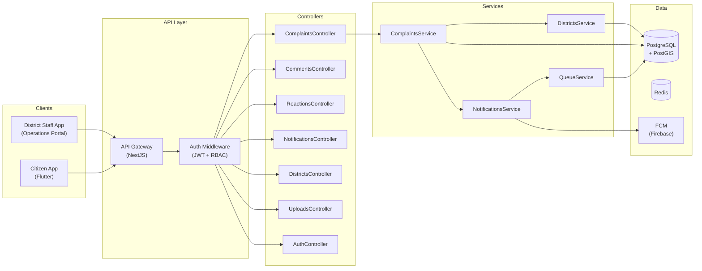
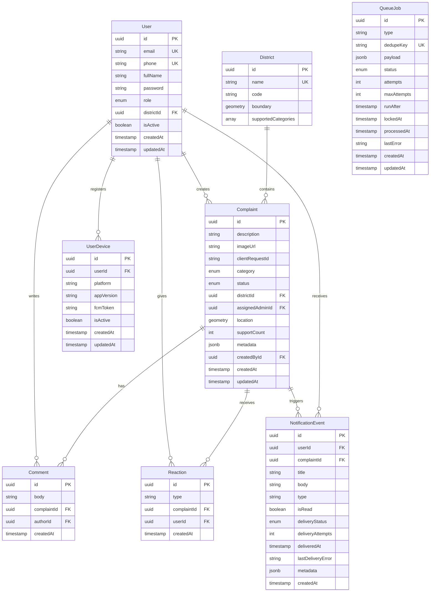

# 🏙️ MyCity Platform — Full Project Report

**Date:** May 5, 2026  
**Version:** 1.0.0  
**Status:** Active Development (Early-Mid Stage)

---

## 1. Executive Summary

**MyCity** is a production-oriented monorepo for a **smart city complaint and municipal service management platform**. It enables citizens to report infrastructure issues (water leaks, road damage, lighting failures, etc.) and district/city administrators to manage, assign, and resolve those complaints.

The project consists of:
- A **NestJS backend** API with JWT auth, RBAC, PostGIS-ready complaint flows, and push notifications
- A **Flutter mobile app** for citizens and district operators
- **Docker + Kubernetes** infrastructure scaffolds
- Comprehensive architecture documentation designed for 10M users at scale

> [!IMPORTANT]
> The project has a solid foundation with well-structured code, but several planned features remain unimplemented (soft delete, analytics, search, SLA timers, admin dashboard). See §9 for the full gap analysis.

---

## 2. Tech Stack

| Layer | Technology | Version |
|-------|-----------|---------|
| **Backend Framework** | NestJS | ^11.0.3 |
| **Language** | TypeScript | ^5.7.2 |
| **ORM** | TypeORM | ^0.3.20 |
| **Database** | PostgreSQL + PostGIS | 16 + 3.4 |
| **Cache** | Redis | 7 (Alpine) |
| **Auth** | Passport + JWT | passport ^0.7, @nestjs/jwt ^11 |
| **Push Notifications** | Firebase Admin (FCM) | ^13.0.2 |
| **Validation** | class-validator + class-transformer | ^0.14.1 / ^0.5.1 |
| **Rate Limiting** | @nestjs/throttler | ^6.2.1 |
| **API Docs** | Swagger / OpenAPI | @nestjs/swagger ^11.3.0 |
| **Mobile Framework** | Flutter | SDK ≥3.4.0 |
| **Mobile Maps** | google_maps_flutter | ^2.9.0 |
| **Testing** | Jest + Supertest | ^29.7.0 / ^7.0.0 |
| **Container** | Docker Compose | 3.9 |
| **Orchestration** | Kubernetes | apps/v1 |
| **DB Admin** | pgAdmin 4 | v8 |

---

## 3. Repository Structure

```
my-city/
├── backend/                    # NestJS API server
│   ├── src/
│   │   ├── app.module.ts       # Root module (all imports)
│   │   ├── main.ts             # Bootstrap + Swagger setup
│   │   ├── auth/               # Authentication (register, login, refresh)
│   │   ├── users/              # User entity & service
│   │   ├── complaints/         # Core complaint CRUD + workflow
│   │   ├── comments/           # Complaint comments
│   │   ├── reactions/          # Complaint support reactions
│   │   ├── districts/          # District boundaries & lookup
│   │   ├── notifications/      # Push notification events + FCM worker
│   │   ├── queue/              # Database-backed job queue
│   │   ├── uploads/            # Upload session management
│   │   ├── health/             # Health check endpoint
│   │   ├── common/             # Guards, decorators, filters, interceptors
│   │   ├── config/             # (empty — not yet used)
│   │   ├── database/           # (empty — not yet used)
│   │   └── telemetry/          # (empty — not yet used)
│   ├── test/                   # E2E tests
│   └── .env.example            # Environment variable template
├── apps/
│   └── mobile/                 # Flutter mobile app
│       └── lib/
│           ├── main.dart
│           ├── app/            # App shell (MyCityApp widget)
│           ├── core/           # Network client, storage, theme
│           └── features/       # Auth, complaints, home map, notifications
├── infra/
│   ├── docker/                 # docker-compose.yml (Postgres, Redis, pgAdmin)
│   └── k8s/                    # api-deployment.yaml (3-replica baseline)
├── docs/                       # Architecture + scaling documentation
├── scripts/                    # Build & diagram generation scripts
├── architecture.json           # Arcforge node/edge architecture graph
├── package.json                # Root workspace config
└── README.md
```

---

## 4. Architecture Overview



---

## 5. Database Schema (8 Entities)

### 5.1 Entity Relationship Diagram



### 5.2 Enums

| Entity | Enum | Values |
|--------|------|--------|
| **User** | `UserRole` | `citizen`, `district_admin`, `city_admin`, `system_admin` |
| **Complaint** | `ComplaintCategory` | `waste`, `water`, `roads`, `lighting`, `drainage`, `other` |
| **Complaint** | `ComplaintStatus` | `pending`, `in_progress`, `resolved` |
| **NotificationEvent** | `NotificationDeliveryStatus` | `pending`, `delivered`, `failed`, `no_devices` |
| **QueueJob** | `QueueJobStatus` | `pending`, `processing`, `completed`, `failed` |

---

## 6. API Surface

**Base URL:** `http://localhost:4000/api/v1`  
**Swagger Docs:** `http://localhost:4000/docs`

### 6.1 Auth Endpoints (Public)

| Method | Path | Description |
|--------|------|-------------|
| `POST` | `/auth/register` | Register a new user |
| `POST` | `/auth/login` | Login with email/phone + password |
| `POST` | `/auth/refresh` | Refresh access token |

### 6.2 Complaints Endpoints (Authenticated)

| Method | Path | Auth | Roles |
|--------|------|------|-------|
| `POST` | `/complaints` | ✅ JWT | Any |
| `GET` | `/complaints` | ✅ JWT | Any (district-scoped for admins) |
| `GET` | `/complaints/:id` | ✅ JWT | Any |
| `PATCH` | `/complaints/:id/status` | ✅ JWT | `district_admin`, `city_admin`, `system_admin` |

### 6.3 Comments Endpoints (Authenticated)

| Method | Path | Auth |
|--------|------|------|
| `POST` | `/complaints/:complaintId/comments` | ✅ JWT |

### 6.4 Reactions Endpoints (Authenticated)

| Method | Path | Auth |
|--------|------|------|
| `POST` | `/complaints/:complaintId/reactions` | ✅ JWT |

### 6.5 Notifications Endpoints (Authenticated)

| Method | Path | Auth |
|--------|------|------|
| `GET` | `/notifications` | ✅ JWT |
| `POST` | `/notifications/devices` | ✅ JWT |

### 6.6 Districts Endpoints (Authenticated)

| Method | Path | Auth |
|--------|------|------|
| `GET` | `/districts` | ✅ JWT |

### 6.7 Uploads Endpoints (Authenticated)

| Method | Path | Auth |
|--------|------|------|
| `POST` | `/uploads/sessions` | ✅ JWT |

### 6.8 Health

| Method | Path | Auth |
|--------|------|------|
| `GET` | `/health` | None |

---

## 7. Mobile App (Flutter)

**18 Dart files** organized in a clean feature-based architecture:

### 7.1 Structure

| Layer | Files | Purpose |
|-------|-------|---------|
| **Core / Network** | `api_client.dart`, `api_exception.dart` | HTTP client with auth headers |
| **Core / Storage** | `offline_queue.dart`, `session_controller.dart` | Offline-first support, session persistence |
| **Core / Theme** | `app_theme.dart` | Material Design theme |
| **Auth Feature** | `auth_repository.dart`, `auth_session.dart`, `sign_in_screen.dart` | Login/session flow |
| **Complaints Feature** | `complaints_repository.dart`, `complaint_record.dart`, `complaint_detail_screen.dart`, `submit_complaint_screen.dart` | Complaint CRUD |
| **Home Feature** | `home_map_screen.dart` | Google Maps-based map view |
| **Notifications Feature** | `app_notification_item.dart`, `notifications_repository.dart`, `notifications_screen.dart` | Push notification feed |

### 7.2 Dependencies

| Package | Purpose |
|---------|---------|
| `google_maps_flutter` | Map view for complaint locations |
| `http` | HTTP client for API calls |
| `image_picker` | Camera/gallery for complaint photos |
| `shared_preferences` | Local session storage |

---

## 8. Infrastructure

### 8.1 Docker Compose (Local Development)

| Service | Image | Port |
|---------|-------|------|
| **PostgreSQL + PostGIS** | `postgis/postgis:16-3.4` | `5432` |
| **Redis** | `redis:7-alpine` | `6379` |
| **pgAdmin** | `dpage/pgadmin4:8` | `5050` |

### 8.2 Kubernetes (Production Baseline)

- **Deployment:** `my-city-api` with **3 replicas**
- **Container:** `my-city/api:latest` on port `4000`
- **Resources:** 250m–1000m CPU, 512Mi–1Gi RAM per pod

---

## 9. Feature Completion Status

### ✅ Implemented

| Feature | Status | Notes |
|---------|--------|-------|
| User registration & login | ✅ Done | Email/phone + password, bcrypt hashing |
| JWT access + refresh tokens | ✅ Done | 15min access, 30-day refresh |
| Role-based access control (RBAC) | ✅ Done | 4 roles with guard + decorator |
| Complaint CRUD | ✅ Done | Create, list, detail, status update |
| PostGIS geospatial location | ✅ Done | Point geometry with SRID 4326 |
| District assignment | ✅ Done | Auto-assign based on location |
| Complaint categories | ✅ Done | 6 categories (waste, water, roads, lighting, drainage, other) |
| Status workflow | ✅ Done | pending → in_progress → resolved |
| Comments on complaints | ✅ Done | Create comments linked to complaint |
| Reactions (support/upvote) | ✅ Done | Unique per user per complaint |
| Push notifications (FCM) | ✅ Done | With local fallback mode |
| Database-backed job queue | ✅ Done | Dedupe, retry with backoff, stats |
| Notification delivery worker | ✅ Done | Polling worker with configurable interval |
| Device registration | ✅ Done | Multi-device per user |
| Idempotency keys | ✅ Done | clientRequestId on complaints |
| Upload sessions | ✅ Done | Session creation (stub for object storage) |
| Swagger / OpenAPI docs | ✅ Done | Auto-generated at `/docs` |
| Rate limiting | ✅ Done | 120 req/min via throttler |
| Global exception filter | ✅ Done | Standardized error responses |
| Request context interceptor | ✅ Done | Logging/tracing context |
| Health check endpoint | ✅ Done | `GET /health` |
| Flutter mobile shell | ✅ Done | All 4 feature modules wired |
| Offline queue (mobile) | ✅ Done | Offline-first complaint submission |
| Docker Compose dev stack | ✅ Done | Postgres + Redis + pgAdmin |
| K8s deployment manifest | ✅ Done | 3-replica baseline |
| Architecture documentation | ✅ Done | Arcforge graph + scaling doc |

### 🔲 Not Yet Implemented

| Feature | Priority | Notes |
|---------|----------|-------|
| Soft delete (users, complaints) | 🔴 High | No `deletedAt` columns exist yet |
| Admin analytics dashboard | 🔴 High | Planned in architecture, not coded |
| SLA timers & escalation | 🔴 High | Described in architecture, not implemented |
| Search index integration | 🟡 Medium | Elasticsearch/Typesense not wired |
| Media processing pipeline | 🟡 Medium | Thumbnails, moderation, antivirus not built |
| Email/SMS notifications | 🟡 Medium | Only FCM push is implemented |
| Read replicas configuration | 🟡 Medium | TypeORM single connection only |
| Redis caching layer | 🟡 Medium | Redis in Docker but not used by app |
| Cursor-based pagination | 🟡 Medium | Using offset pagination currently |
| Complaint re-open workflow | 🟡 Medium | Only forward transitions exist |
| Admin complaint assignment UI | 🟡 Medium | Backend endpoint exists, no admin UI |
| Audit logging for admin actions | 🟡 Medium | Mentioned in docs, not implemented |
| Config module usage | 🟢 Low | `config/` directory is empty |
| Database migrations | 🟢 Low | Using `synchronize: true` (dev-only) |
| Telemetry / tracing | 🟢 Low | `telemetry/` directory is empty |
| Unit tests | 🟢 Low | Only 1 E2E test (health check) |
| CI/CD pipeline | 🟢 Low | No GitHub Actions or similar |

---

## 10. Security Analysis

### ✅ Strengths
- JWT with separate access/refresh secrets and short access TTL (15 min)
- Password hashing with bcrypt (cost factor 10)
- RBAC guard on sensitive endpoints
- District-scoped queries for `district_admin` role
- Input validation with `whitelist` + `forbidNonWhitelisted`
- Rate limiting (120 req/min)
- Idempotency keys to prevent duplicate submissions

### ⚠️ Concerns

> [!WARNING]
> **Hardcoded fallback secrets** — The JWT secrets (`replace-me-access`, `replace-me-refresh`) fallback values in `auth.service.ts` mean the app will run with known secrets if `.env` is missing. This is dangerous if accidentally deployed to production.

> [!WARNING]
> **`synchronize: true` in production risk** — The TypeORM auto-sync logic only disables if `NODE_ENV=production` AND `DB_SYNC=false`. A misconfigured production deployment could auto-alter the database schema.

> [!CAUTION]
> **No database migrations** — Running with `synchronize: true` is acceptable for development but must be replaced with proper TypeORM migrations before production deployment.

- CORS is set to `true` (allows all origins) — needs restriction for production
- No audit trail entity for admin operations
- Password field excluded from selects (`select: false`) ✅ — good practice

---

## 11. Code Quality Assessment

| Aspect | Rating | Notes |
|--------|--------|-------|
| **Project organization** | ⭐⭐⭐⭐⭐ | Clean monorepo with workspace, feature-based modules |
| **TypeScript strictness** | ⭐⭐⭐⭐ | Non-null assertions used throughout entities (standard for TypeORM) |
| **Separation of concerns** | ⭐⭐⭐⭐⭐ | Controller → Service → Repository pattern consistently applied |
| **Error handling** | ⭐⭐⭐⭐ | Global exception filter, proper NotFoundException usage |
| **API design** | ⭐⭐⭐⭐ | RESTful, versioned, Swagger-documented |
| **Test coverage** | ⭐ | Only 1 E2E test for health check |
| **Documentation** | ⭐⭐⭐⭐ | README, architecture graph, scaling doc, env example |
| **Mobile architecture** | ⭐⭐⭐⭐ | Feature-based with data/presentation split, offline support |

---

## 12. Scalability Readiness

The project has a well-documented [scaling-and-deployment.md](file:///c:/Users/xamse/OneDrive/Desktop/hamze.apps/my-city/docs/scaling-and-deployment.md) plan targeting **10M users / 1M concurrent**. Current implementation status against that plan:

| Scaling Target | Status |
|---------------|--------|
| Stateless API replicas | ✅ Ready (K8s manifest) |
| PostgreSQL + PostGIS | ✅ Implemented |
| Read replicas | 🔲 Not configured |
| Redis cluster cache | 🔲 Running but not integrated with app logic |
| Queue workers | ✅ Notification delivery worker done |
| Object storage + CDN | 🔲 Upload sessions created, no actual storage backend |
| Search index | 🔲 Not implemented |
| Cursor pagination | 🔲 Using offset pagination |
| Time-based partitioning | 🔲 Not implemented |

---

## 13. Rollout Progress (per docs/scaling-and-deployment.md)

The project's own documented rollout plan states 6 phases:

| Phase | Description | Status |
|-------|-------------|--------|
| 1 | Core auth + complaint write path | ✅ **Complete** |
| 2 | District assignment + admin workflow | ✅ **Complete** (basic) |
| 3 | Comments + reactions | ✅ **Complete** |
| 4 | FCM registration + status notifications | ✅ **Complete** |
| 5 | Offline sync and upload hardening | 🟡 **Partial** (mobile offline queue exists, uploads are stubs) |
| 6 | Read replicas, queue workers, search, analytics | 🔲 **Not started** |

---

## 14. Recommendations

### Immediate (Before Any Production Deployment)

1. **Remove hardcoded JWT fallback secrets** — Fail fast if secrets are missing
2. **Replace `synchronize: true`** with proper TypeORM migrations
3. **Restrict CORS origins** to your actual domain(s)
4. **Add database migrations** — Create an initial migration from current schema
5. **Implement soft delete** — Add `deletedAt` columns to User and Complaint

### Short-Term (Next Sprint)

6. **Add unit + integration tests** — Target complaint service, auth service, queue service
7. **Wire Redis caching** — Cache district lookups and complaint feed queries
8. **Implement SLA timers** — Use the queue system for escalation deadlines
9. **Add admin analytics endpoints** — Trend charts, category breakdowns
10. **Set up CI/CD** — GitHub Actions for lint, test, build, deploy

### Medium-Term

11. **Search integration** — Add Elasticsearch or Typesense for complaint search
12. **Media pipeline** — Implement actual object storage uploads with thumbnail generation
13. **Email/SMS notifications** — Add additional notification channels
14. **Cursor-based pagination** — Replace offset pagination for large datasets
15. **Implement config module** — Move environment validation to NestJS ConfigModule
16. **Add telemetry/tracing** — OpenTelemetry integration for observability

---

## 15. File Count Summary

| Area | Files | Lines of Code (approx.) |
|------|-------|------------------------|
| Backend source | ~40 files | ~3,500 LOC |
| Backend tests | 2 files | ~40 LOC |
| Mobile app | 18 files | ~1,500 LOC |
| Infrastructure | 2 files | ~65 LOC |
| Documentation | 3 files + architecture.json | ~650 LOC |
| Scripts | 4 files | ~1,400 LOC |
| **Total** | **~69 source files** | **~7,150 LOC** |
